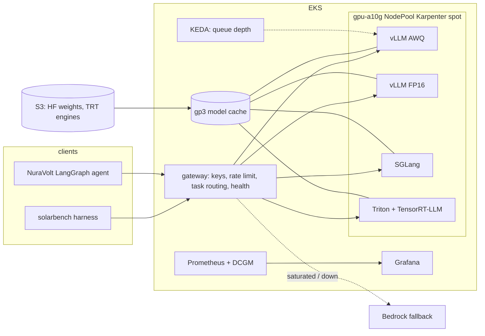

# solar-llm-serving

A self-hosted LLM inference platform, built and measured end to end on AWS GPU infrastructure, driven by the
language tasks a solar-operations product actually runs: alarm narration, ticket triage, fault-log extraction, daily
report summaries and agent tool calls.

Three serving stacks (**vLLM**, **SGLang**, **TensorRT-LLM behind Triton**), two precisions (FP16, INT4-AWQ), one
benchmark harness that reports TTFT, TPOT, throughput, goodput under an SLO, GPU memory and **dollars per million
tokens**, deployed on **EKS with Karpenter** GPU nodes that exist only while a pod needs them, **KEDA** autoscaling
on queue depth, a routing **gateway** with Bedrock fallback, and Prometheus/DCGM/Grafana observability. Every claim
in this README points at a number in [`docs/results.md`](docs/results.md).

> Status: code complete, benchmark runs pending. The results table below fills in as the runbook is executed.

## Headline

_See [`docs/results.md`](docs/results.md); regenerated by `solarbench report`._

## Architecture



## What is in the repo

| Path | What |
|---|---|
| `solarbench/` | Workload generator (five task classes, synthetic solar fleet, ground truth for structured tasks), streaming OpenAI client with per-request timings, open-loop/closed-loop runner, Prometheus sampler, memory-budget calculator, quality scorer, report renderer, mock server |
| `gateway/` | FastAPI OpenAI-compatible gateway: API keys, token-bucket rate limits, task-class routing, saturation-aware Bedrock fallback, token accounting, optional OpenTelemetry |
| `stacks/` | Docker Compose per engine (vLLM variants incl. no-prefix-cache, n-gram speculative decoding, TP=4; SGLang; TRT-LLM engine build + Triton repo + OpenAI frontend) and the observability stack with Grafana dashboards |
| `charts/` | Helm chart for any engine (GPU scheduling, cache PVC seeded from S3, probes, ServiceMonitor, KEDA ScaledObject, PDB, NetworkPolicy), gateway chart, time-slicing and in-cluster load experiments |
| `infra/terraform/` | `budget` (cost alarm), `single-gpu` (g5 spot instance for sweeps and engine builds), `eks` (VPC, EKS, Karpenter GPU NodePool with scale-to-zero, device plugin + GFD, DCGM, kube-prometheus-stack, KEDA, Pod Identity) |
| `docs/` | `runbook.md` (the exact order the results were produced in), `security.md`, `nuravolt-integration.md`, `results.md` (generated) |
| `results/` | One directory per run: config, summary, per-second engine and GPU metrics; raw per-request logs are not committed |

## Quick start (no GPU)

```bash
make venv && source .venv/bin/activate
solarbench gen                          # deterministic dataset -> solarbench/datasets/solar_ops_v1.jsonl
pytest -q                               # harness, gateway and workload tests against an in-process mock engine
make mock &                             # OpenAI-compatible mock on :8000 with vLLM-shaped /metrics
make bench-mock                         # a 10 s open-loop run: summary.json, metrics.csv, cost columns
solarbench budget --model Qwen/Qwen3-8B --dtype awq --gpu A10G   # how many KV tokens fit
```

## Quick start (one GPU, AWS)

```bash
export TF_VAR_ssh_cidr=$(curl -s ifconfig.me)/32 TF_VAR_bucket_name=solar-llm-models-<account-id>
make up-single                          # g5.xlarge spot, Deep Learning AMI, SSM
# on the instance: see docs/runbook.md section 1
```

## The workload

| Task class | Mirrors | Prompt | Output | Stress |
|---|---|---|---|---|
| `alert_narration` | alarm explanation to a technician | ~150 tok | ~80 tok free text | short everything; TTFT floor |
| `ticket_triage` | operator note → ticket | ~400 tok | JSON (schema) | guided decoding; field accuracy |
| `fault_log_extraction` | inverter event log → events | 2–4k tok | JSON list | long prefill; chunked prefill; recall |
| `daily_report_summary` | production report → manager summary | ~3k tok | ~400 tok | decode-heavy; speculative decoding |
| `agent_tool_turn` | NuraVolt agent step (17 MCP tool schemas + question) | ~2.5k shared + ~30 | tool-call JSON | prefix caching; tool choice accuracy |

All data is synthetic (`solarbench/workload/world.py`); structured tasks carry ground truth so quality is scored,
not eyeballed. The mix is configurable; the committed dataset is 200 requests at the default mix.

## Relation to NuraVolt

[NuraVolt](https://github.com/jeffreymokumtech/nuravolt) is the solar and storage operations product whose LangGraph
agent this platform serves through `OPENAI_BASE_URL`. `docs/nuravolt-integration.md` runs the agent's own live eval
against the gateway. The two repos are the application layer and the inference layer of one system.


NCP-AIO certification; each names the exam domain it covers.

## Licence

All rights reserved. The code is published for review; ask before reusing it.
